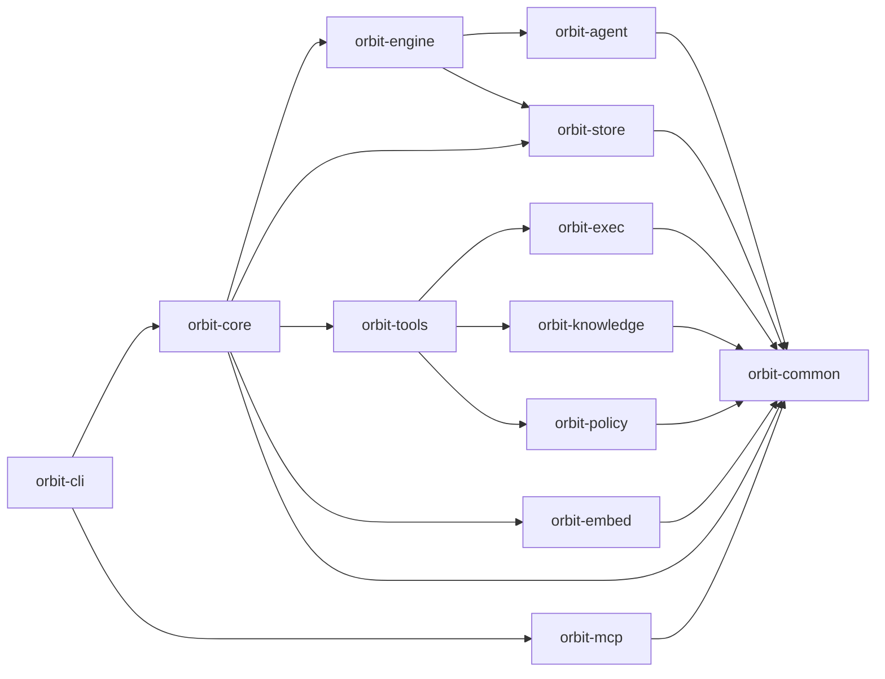

# Architecture

Layered Rust crates. Lower layers do not depend on higher layers.

---

## Crates

- **orbit-common**: leaf — no internal deps. `types::` owns shared domain types, `OrbitError`, ID generation, and activity/job schemas; `utility::` owns generic helpers like fs, redaction, logging, and blob storage.
- **orbit-policy**: filesystem-scoping policy engine. Owns `FsProfile` resolution and `denyRead` / `denyModify` evaluation. Depends only on `orbit-common`.
- **orbit-exec**: process / sandbox / supervision primitives for shell-command execution under an `FsProfile`. Depends only on `orbit-common`.
- **orbit-embed**: semantic-embedding feature crate. Owns the `Embedder` trait, JSON-Lines RPC types, `SubprocessEmbedder`, `NoopEmbedder`, the workspace-local vector store (`vector::VectorStore` with its own `rusqlite::Connection`, WAL + busy_timeout pragmas, idempotent `embeddings` / `tasks_fts` schema, `EmbedWorker`, paragraph chunker, BLAKE3 dedup, cosine helper), and the install/uninstall/reindex/stats `commands::*` surface. Depends only on `orbit-common`; does not depend on `orbit-store` or fastembed-rs.
- **orbit-embed-companion**: separately installed embedding companion binary. Depends on `orbit-embed` and fastembed-rs; not linked into the default `orbit` CLI binary.
- **orbit-knowledge**: knowledge/graph parsing and storage helpers. Multi-language source parsing (Rust, Go, Java, JavaScript/TypeScript, Python). Depends on `orbit-common`; consumed by `orbit-tools`, which exposes graph tool and CLI-use-case facades upstream.
- **orbit-store**: layered store pattern (YAML + SQLite). Match existing modules when adding new ones. Depends only on `orbit-common`; the semantic vector schema is owned by `orbit-embed::vector` (not `orbit-store`).
- **orbit-tools**: tool registry plus built-in graph, fs, and policy-aware exec tools. Depends on `orbit-common`, `orbit-exec`, `orbit-knowledge`, `orbit-policy`.
- **orbit-mcp**: Model Context Protocol adapter using `rmcp`. Depends only on `orbit-common`; consumed by `orbit-cli` via `orbit mcp serve`.
- **orbit-agent**: per-provider `AgentRuntime` implementations under `providers/<name>/<name>_runtime.rs` (claude, codex, gemini, openai_compat, anthropic, ollama, mock_agent). Implements `backend: cli`. Also hosts HTTP `LoopTransport` primitives.
- **orbit-engine**: activity/job execution, template rendering, retry logic. Owns the `backend: cli` subprocess runner (`activity_job::cli_runner`), which references `orbit-agent::{Agent, AgentConfig}` directly so orbit-core stays clean of orbit-agent types.
- **orbit-core**: runtime bootstrap, config layering, command dispatch, default asset seeding. Surfaces the `OrbitRuntime` API used by `orbit-cli`; does NOT depend on `orbit-agent`.
- **orbit-cli**: clap-based CLI entry point.

---

## Scoping Rules

| Artifact        | Strategy           | Rationale                                        |
|-----------------|--------------------|--------------------------------------------------|
| Tasks           | WorkspaceOnly      | Per-repo backlog, no cross-project leaking       |
| Activities/Jobs | MergeByKey         | Global defaults + workspace overrides            |
| Policies        | MergeByKey         | Workspace overrides profiles by name; global `denyRead` / `denyModify` rules accumulate |
| Job Runs        | WorkspaceOnly      | Execution artifacts are workspace-local          |
| Skills          | MergeByKey         | Global defaults in `~/.orbit/skills`; workspace overrides by skill name |
| Command Audit   | GlobalOnly         | Single authoritative SQLite event trail          |
| Semantic Index  | WorkspaceOnly      | Task-derived embeddings stay with the workspace  |
| Run Traces      | WorkspaceOnly      | Per-repo activity/job JSONL and blob artifacts   |

