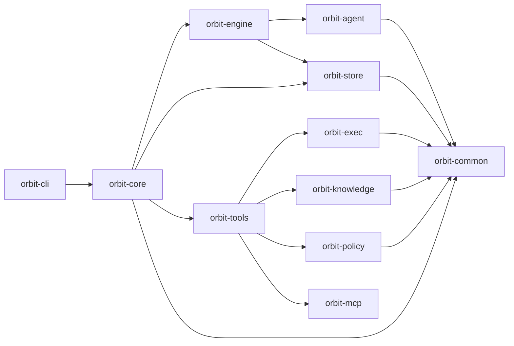

# Orbit — Linear for AI-Native Developers

<p align="center">
  
</p>

<p align="center">
  <em>The Orbit dashboard (<code>orbit web serve</code>) — task backlog, live audit log, per-agent scoreboard.</em>
</p>

**Orbit is durable, intent-tracked agentic project management for developers who use AI coding agents heavily — Linear / Jira designed for the AI-native solo developer, with a path to team-scale automation as trust in agents matures.**

The wedge today is the individual engineer driving multiple coding agents (Claude Code, Cursor, Aider, Codex CLI) against real code, who has outgrown the one-agent-one-terminal model. You need a durable backlog when ideas and bugs accumulate faster than any single session can hold. You need lifecycle tracking when work spans sessions, weeks, or branches. You need intent attribution when six months from now you have to remember *why* an agent wrote a given line of code. Linear and Jira solve durable project management for human-driven teams. Agent vendors solve in-session execution. **Orbit is the layer above — the layer that turns individual agent sessions into a coherent body of work.**

Built for the AI-native solo developer first, with a deliberate funnel that expands toward teams over time: **solo adoption → internal champion at a team → team-scale agentic automation.** The team-scale destination is multi-year. The wedge is today.

The full positioning — what Orbit is for, who it's for in funnel order, what it refuses to become, and the long-arc fleet vision — lives in [docs/POSITIONING.md](docs/POSITIONING.md). Read it before contributing or evaluating fit.

---

## Primary Features

Three features carry the wedge. Everything else is infrastructure that makes these reliable.

### Durable, intent-tracked task layer — *available today*

The wedge surface. Every task carries a durable lifecycle (`proposed → backlog → in-progress → review → done`) that survives across sessions, branches, and weeks. Every commit produced through Orbit carries the `task_id`, so the codebase itself becomes a queryable record of agent intent — `git log --grep '\[T20260506-...\]'` finds every commit that flowed through a given task; `orbit task show` reconstructs the prompt, plan, execution trace, and review threads for that task months later.

The hand-tracking-in-Notion-or-scratch-notes problem ends here. Ideas and bugs go into `orbit task add`, get worked on by an agent (now or later), and produce a body of work that's still navigable a year from now. This is what Linear and Jira solve for human-driven teams; Orbit solves it for the AI-native solo developer who plans to expand the practice across their team.

### Knowledge-graph–aware tooling — *available today*

Agents inspect a parsed, content-addressed graph of your codebase: directories, files, extracted symbols, import edges, crate dependencies, trait implementors, and signature-matched caller/reference indexes. Queries return token-budgeted packs shaped for prompt consumption, not LSP-style hover text.

The graph is the **technical moat** and it is measured, not asserted. Under MCP exposure, the graph reduces token cost on structural code questions (see `benchmarks/graph/` for full v3 results: codex hybrid arm came in 35% cheaper than no-graph, with pre-registered cull thresholds passed). It is also branch-scoped and built for safe parallel execution — two worktrees on two branches rebuild concurrently without corruption; reads fall back to the default branch until a new branch has been built. The public graph surface is read-only; write coordination happens before dispatch through task `context_files` and `orbit.task.locks.reserve` preflight guards.

Design docs: [docs/design/knowledge-graph/](docs/design/knowledge-graph/).

### Auditability — *available today*

Every tool call, provider request/response, and task-state transition is a structured, queryable event with agent identity attached. When something goes sideways — a bad merge, a regression, a refactor whose intent you can't reconstruct months later — you answer *what / why / who* without asking the maintainers. Append-only, tamper-evident, exportable.

For the wedge audience (single engineer, multiple agents, real code), this is what makes ad-hoc agent sessions trustworthy enough to live with downstream — both for you, and for the future teammate who reviews your PR. For the long-arc team-scale destination, it's also the substrate every team-grade primitive depends on.

Full contract below in the [Auditability](#auditability) section. Design docs: [docs/design/auditability/](docs/design/auditability/).

---

## Direction of travel

The substrate also hosts work that is not yet a front-door product surface but signals where Orbit is headed. The full long-arc destination — fleet orchestration at team scale, once trust in agents matures and human review thins — lives in [POSITIONING § Long-arc vision](docs/POSITIONING.md#long-arc-vision-fleet-orchestration-at-team-scale).

- **Programmatic (HTTP/SDK) provider transport** — direct provider communication for multi-turn agent loops, replacing CLI subprocess execution as the primary path. Wired in code today (`backend: http`, `LoopTransport`) but not part of the v1 release surface; v1 ships CLI backends only.
- **Groundhog** — a checkpoint-oriented execution mode for HTTP-backend agents. Work runs as a sequence of checkpoints; each attempt starts with a fresh agent context and a clean git-backed workspace snapshot, then either rewinds on failure or persists a small stable memory on success. Today it exists as an `ActivityV2Spec::Groundhog` activity behind the job layer, not as an `orbit run` subcommand. Depends on the HTTP transport above and is therefore also out of scope for v1. Status: [docs/design/groundhog/](docs/design/groundhog/).
- **Shared-host deployment** — a single Orbit instance serving multiple operators, with team-aggregated audit, tasks, and scoreboards, plus operator-identity-aware authentication on `orbit web serve`. v1 is per-engineer (each operator runs Orbit on their own machine); shared-host is a v2 commitment, downstream of the champion-led team-adoption arc described in POSITIONING. Until v2 ships, do not expose `orbit web serve` to a non-localhost interface — it has no auth in v1.

---

## Non-negotiables

Tablestakes for what Orbit is for. Orbit will not ship anything that breaks them.

- **Self-hostable, no cloud dependency.** Single binary, runs on a laptop, in a container, in a CI runner, behind a firewall. Orbit never phones home.
- **Per-engineer deployment in v1.** Each engineer runs Orbit on their own machine. Tasks, locks, and the audit DB are local to that machine. Cross-engineer coordination flows through the primitives a team already uses — git branches, PRs, CI, GitHub. Shared-host deployment (one Orbit serving multiple engineers) is a v2 commitment downstream of the champion-led team-adoption arc; see [POSITIONING § Long-arc vision](docs/POSITIONING.md#long-arc-vision-fleet-orchestration-at-team-scale).
- **Bring-your-own-credentials.** Your Anthropic / OpenAI / local-model keys, never Orbit's. Orbit is a pass-through.
- **CLI-backend agent execution (v1).** v1 invokes coding agents through their official CLIs (Codex, Claude Code, Gemini CLI) as supervised subprocesses. Programmatic HTTP/SDK transport (`backend: http`, `LoopTransport`) exists in the codebase and is exercised in tests, but is not a supported release surface in v1 — treat it as preview-only. v2 will flip the default once HTTP coverage is complete.
- **Intent attribution at the codebase level.** Every line of agent-authored code is traceable to the task that produced it. `task_id` baked into commit messages, queryable via `orbit task show` and `git log --grep`, durable across rewrites and refactors. This is what turns a body of agent work into a coherent record over time, instead of a stream of opaque diffs.
- **Multi-agent capable, agent-identity-attributed.** The architecture treats fleets as the default execution shape (parallel task execution, cross-provider delegation, per-agent scoreboards, per-agent commit identity), even though the wedge audience may run only one or two agents at a time today. Single-assistant assumptions are incorrect, and agent identity is attached to every write so the audit trail and PR history stay legible at any scale.
- **Git- and GitHub-native.** Branches, worktrees, PRs, CI status. No custom version control abstractions.
- **Cost-visible.** You know what each run cost in tokens and wall-clock — see `orbit audit stats` and `orbit metrics`.
- **Configurable, not rigid.** Job DAGs, activity definitions, skill loadouts, role profiles are all YAML. Fork, don't file feature requests.

---

## The Core Model

Orbit is built around four concepts you will actually touch:

- **Task** — the durable unit of work. You create one, approve it, and let Orbit dispatch agents against it. Tasks are versioned, auditable, and scoped to a workspace.
- **Knowledge graph** — the parsed structure of your codebase. Agents query it instead of grep-ing. It is what makes parallel scheduling safe and what distinguishes Orbit from a generic agent framework.
- **Worktree** — each agent session runs in an isolated git worktree so parallel work does not stomp on your checkout. Reconciliation happens when the agent finishes.
- **Locks** — explicit claims on files or code regions that prevent overlapping parallel edits. A task reserves its locks before dispatch; if the reservation would conflict, the task waits.

Supporting primitives (`activity`, `job`, `policy`, `executor`, `tool`) are the substrate those four concepts run on. They are inspectable on purpose — Orbit's audit thesis requires it — but they are not the product story.

---

## Quick Start

**Prerequisites**: at least one supported agent CLI installed and authenticated (Codex, Claude Code, or Gemini CLI). v1 invokes these CLIs as subprocesses — the agent CLI is responsible for talking to the model provider, so Orbit does not need a separate provider API key.

Orbit itself can be installed without Rust. Only source builds require a Rust toolchain.

For the default PR-based execution path (`orbit run ship`), you also need the GitHub CLI (`gh`) installed and authenticated. If you do not want to use GitHub or open pull requests, use `orbit run ship --mode local` instead.

```bash
# install via curl | sh (macOS and Linux)
curl -sSf https://raw.githubusercontent.com/danieljhkim/orbit/agent-main/install.sh | sh

# or install via Homebrew (macOS)
brew install danieljhkim/tap/orbit

# or, if you use Claude Code: install the plugin (it registers MCP + skills
# and downloads the native binary on first use; requires Node 18+)
#   /plugin marketplace add danieljhkim/orbit
#   /plugin install orbit

# or build from source
git clone https://github.com/danieljhkim/orbit.git
cd orbit
make install

# initialize global Orbit state (~/.orbit), global skills, and user-level skill links
orbit init

# initialize workspace-local Orbit state inside a repository
cd <repo>
orbit workspace init
# or also auto-detect and set up MCP client integrations
orbit workspace init --mcp

# create a task for the work you want done (prints the new task ID)
TASK_ID=$(orbit task add \
  --title "Create orbit-hello.txt" \
  --description "Add orbit-hello.txt at the repository root containing the text 'hello from orbit'." \
  --acceptance-criteria "orbit-hello.txt exists at the repository root." \
  --acceptance-criteria "orbit-hello.txt contains the text 'hello from orbit'." \
  --workspace .)
echo "$TASK_ID"

# or simply ask an agent to create a task
"create an orbit task for ..."

# review and approve the created proposed task
orbit task list --status proposed
orbit task show "$TASK_ID"
orbit task approve "$TASK_ID"

# run the default PR-based execution path
orbit run ship "$TASK_ID"

# or run a local-only execution path
orbit run ship --mode local "$TASK_ID"
```

If you prefer conversational drafting, ask an agent to produce the `orbit task add ...` command for your real task, then run that command and continue with the same review + ship flow.

If you already know which task(s) you want to run, pin them explicitly:

```bash
orbit run ship T123 T456 --base main
```

Pinned installs and custom install directories are supported:

```bash
curl -sSf https://raw.githubusercontent.com/danieljhkim/orbit/agent-main/install.sh | ORBIT_VERSION=v0.3.0 sh
curl -sSf https://raw.githubusercontent.com/danieljhkim/orbit/agent-main/install.sh | ORBIT_INSTALL_DIR="$HOME/.local/bin" sh
```

---

## Why Orbit Exists

The hard problem is not "how do I run steps in order?" Durable workflow engines (Temporal, Airflow) already solve that. And the hard problem is not "how does an agent edit code?" — agent vendors (Claude Code, Cursor, Aider, Codex CLI) already solve that, and well, in-session.

The hard problem the wedge user has is everything that lives **between** and **around** those agent sessions:

- how to keep durable, queryable state across many short-lived agent sessions
- how to know six months from now *why* an agent wrote a given line of code
- how to manage a backlog of agent-actionable work that grows faster than any one session can hold
- how to drive multiple agents in parallel without losing track of who did what to which file
- how to do all of that with durable **local** state, under an audit trail you control, without routing your source through a third-party SaaS

Linear and Jira solve durable project management for human-driven teams. Agent vendors solve in-session execution. Orbit is the layer that turns individual agent sessions into a coherent, navigable, audited body of work — for the AI-native solo developer today, with the architectural path to team-scale fleet orchestration once trust in agents matures (see [POSITIONING § Long-arc vision](docs/POSITIONING.md#long-arc-vision-fleet-orchestration-at-team-scale)).

---

## Auditability

When something goes wrong on your team's monorepo, you need to answer three questions without calling the Orbit maintainers: **what** the agent did, **why** it did that, and **who** is accountable. Every tool call, provider request/response, and task-state transition is a structured, queryable event with agent identity attached. Audit is append-only and tamper-evident; prompts and responses are stored verbatim with configurable redaction.

When auditability conflicts with performance, ergonomics, or feature surface, auditability wins.

The full contract — coverage commitments, schema stability, reproducibility, tamper-evidence — lives in [docs/POSITIONING.md](docs/POSITIONING.md#primary-focus-auditability). Query command audit rows with `orbit audit list`, `orbit audit show`, and `orbit audit stats`. Inspect run-local activity/job traces with `orbit run events <run_id>` and `orbit run trace <run_id>`.

---

## Graph-Aware Scheduling

Orbit already contains the pieces that matter most to its thesis:

- code graph build and query via `orbit graph`
- automatic task bundling and fan-out dispatch
- gate pipelines that wait for safe execution windows
- explicit task lock reservation before dispatch
- isolated worktree-based execution for bundles

The knowledge graph is described in [docs/design/knowledge-graph/](docs/design/knowledge-graph/). It is not generic workflow authoring — it is graph-aware scheduling and conflict management for parallel coding agents.

---

## Primary Commands

### Graph

```bash
orbit graph build
orbit graph update
orbit graph search <query>
orbit graph show <selector>
```

Build and inspect the code-aware structure Orbit uses for partitioning and scheduling.

### Execution

```bash
orbit run ship <task_id> ...
orbit run ship --mode local <task_id> ...
orbit run ship-auto
orbit run duel-plan <task_id>
orbit run job <job_id>

# audits and observability
orbit run show [run_id]
orbit run logs [run_id]
orbit run events [run_id]
orbit run trace [run_id]
```

- `ship` runs explicitly selected tasks through the PR pipeline by default.
- `ship --mode local` runs explicitly selected tasks through the local-only path.
- `ship-auto` auto-selects backlog tasks and dispatches them through the same PR/local mode switch.
- `duel-plan` runs the planning-duel workflow for one task.
- `show`, `logs`, `events`, and `trace` inspect the most recent run by default, or a specific run ID when supplied.
- use `orbit run history -j <job_id>` and `orbit run show <run_id>` for durable job-run history and state.

### Tasks

```bash
orbit task add
orbit task list
orbit task show <task_id>
orbit task artifact put <task_id> <source_path>
orbit task approve <task_id>
```

Tasks are the durable unit of work. Newly created tasks enter `proposed`; `approve` moves proposed work into the backlog and approves completed review work into done.

### Audit and Observability

```bash
orbit audit list
orbit audit show <event_id>
orbit audit stats
orbit run events <run_id>
orbit run trace <run_id>
```

Every agent action is queryable. `orbit audit` reads compact command-audit rows; `orbit run events` and `orbit run trace` read workspace-local activity/job run traces from `.orbit/state/audit/`. Treat this as a first-class surface, not a debug tool.

---

## Operating Surfaces

### Workspace state

Orbit artifacts have two scopes: **global** (initialized via `orbit init`, under `~/.orbit/`) and **workspace** (initialized via `orbit workspace init`, under `<repo>/.orbit/`).

```text
.orbit/
├── knowledge/        # Code graph artifacts
├── resources/        # Workspace overrides for activities, jobs, policies, executors, skills
├── state/            # Audit traces, diagnostics, job runs, scoreboards, worktrees
└── tasks/            # Durable task state
```

Tasks, job runs, scoreboards, and run traces are workspace-local. Graph artifacts are workspace-local and branch-scoped. Activities, jobs, policies, and skills merge global defaults with workspace overrides. Default skills are initialized under `~/.orbit/skills` and linked into `~/.agents/skills` and `~/.claude/skills`. Command audit events live globally in SQLite.

### Filesystem guardrails

Orbit uses filesystem-scoped policies to control what agent execution can read and modify — safe parallel execution is the core problem, not just prompt routing. A v2 activity can opt into a named filesystem profile with `fsProfile`; if it omits the field, Orbit resolves an implicit unrestricted profile and still applies global deny rules. Design docs: [docs/design/policy-sandbox/](docs/design/policy-sandbox/).

> **Platform support.** OS-level sandbox enforcement of `fsProfile` for spawned agent CLIs is currently **macOS only**, via `sandbox-exec`. The bundled `claude`, `codex`, and `gemini` executors declare `sandbox: macos-sandbox-exec` and will refuse to launch with a sandbox on Linux/Windows; on those platforms the policy still applies as in-process FS guards for HTTP-tool calls, but the spawned agent subprocess itself runs without OS-level isolation. Linux/Windows backends are not yet implemented.

```yaml
schemaVersion: 2
kind: Policy
metadata:
  name: default
spec:
  denyRead:
    - "**/*.env"
  denyModify:
    - .orbit/**
    - "**/*.env"
  fsProfiles:
    reviewer:
      read: [./**]
      modify: []
```

### MCP integration

Orbit exposes a safe MCP surface by default: `orbit.task.*` tools and read-only `orbit.graph.*` tools, including `search`, `show`, `pack`, `refs`, `callers`, `implementors`, `deps`, `overview`, and `history`. No graph write tools — write coordination flows through task lock reservations such as `orbit.task.locks.reserve`.

```bash
orbit mcp init --auto    # detects .claude/, .gemini/, ~/.codex/config.toml
orbit mcp init --claude  # writes <repo>/.mcp.json + <repo>/.claude/settings.json
orbit mcp init --codex   # writes <repo>/.codex/config.toml (repo must be trusted in Codex)
orbit mcp init --gemini  # writes <repo>/.gemini/settings.json
orbit mcp serve
```

`orbit mcp init` defaults to workspace scope (repo-local files). Pass `--scope home` to register at the user level instead (e.g. `~/.claude/.mcp.json`, `~/.codex/config.toml`, `~/.gemini/settings.json`). `.claude/settings.local.json` and `~/.gemini/settings.json` are user override layers and are never modified. MCP support is an integration layer, not Orbit's moat.

### Advanced surfaces

Lower-level operating surfaces are intentionally available because durable local state is part of the product:

- `activity` and `job` for defining and running substrate assets directly
- `policy`, `executor`, and `tool` for runtime customization
- `orbit scoreboard`, `orbit run history -j <job_id>`, `orbit run show/logs/events/trace`, and `orbit run job <id>` for evaluation, history, trace inspection, and direct workflow execution
- `metrics` and `serve` for observability and outward integration

Most users can ignore these on day one. Reach for `orbit --help` and `orbit <command> --help` when you need the deeper surface area.

---

## Architecture

Orbit is structured as a layered set of Rust crates. Lower layers do not depend on higher layers.



Two details matter most:

- **`orbit-knowledge`** provides the graph substrate. Design docs in [docs/design/knowledge-graph/](docs/design/knowledge-graph/).
- **`orbit-engine`** and **`orbit-agent`** provide the execution substrate. v1 ships `backend: cli` as the only supported agent invocation path: CLI subprocess providers (Codex, Claude Code, Gemini CLI, etc.) under `orbit-agent::providers/*`. The HTTP `LoopTransport` and `backend: http` exist in the codebase for v2 work but are not covered by the v1 release contract. Design docs in [docs/design/activity-job/](docs/design/activity-job/) and [docs/design/groundhog/](docs/design/groundhog/).

That is the center of gravity for Orbit.

---

## Current Status

Orbit is a work in progress.

- core local execution primitives are usable today
- graph build and query are available today
- audit infrastructure is live; coverage still expanding
- the execution substrate shows more internal machinery than the final product should
- some historical surfaces remain in the CLI even though they are no longer central
- production or multi-machine deployments are not yet recommended — we expect to lift this once audit coverage is complete and the lower-level activity/job surfaces are folded behind the task and graph product surfaces

The repository currently contains more workflow and task machinery than the long-term public story should emphasize. That is intentional technical debt on the path toward a tighter product focused on graph-aware agent scheduling.

---

## Contributing

Contributions focused on **graph-aware scheduling, locking, worktree/session management, execution primitives, reconciliation, audit coverage, and tool-calling interfaces** are especially welcome.

Before contributing, read:

- [docs/design/CONVENTIONS.md](docs/design/CONVENTIONS.md) — design doc conventions (required reading if you touch `docs/design/`)
- [CLAUDE.md](CLAUDE.md) — project-wide instructions for human and agent contributors

Open an issue or submit a pull request for review.
