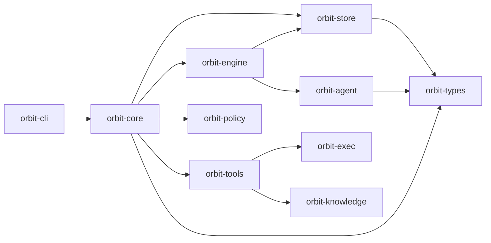

# Orbit: Local-First Agentic Workflow Engine

Orbit is a local-first workflow engine for agent-driven software delivery. It helps humans and coding agents coordinate around structured tasks, reusable activities, and repeatable job pipelines directly inside a repository.

Orbit runs on top of agent CLIs such as Codex and Claude Code. No provider API keys are required by Orbit itself.

---

## Quick Start

**Prerequisites**: Codex CLI, Gemini CLI, or Claude Code

Orbit itself can be installed without Rust. Only source builds require a Rust toolchain.

Suggestion: Get cheapest tier subscriptions for above 3, and milk every dollar out of it.

For the default PR-based ship workflow (`orbit run ship`), you also need the GitHub CLI (`gh`) installed and authenticated. If you do not want to use GitHub or open pull requests, use `orbit run ship local` instead.

```bash
# install via curl | sh (macOS and Linux)
curl -sSf https://raw.githubusercontent.com/danieljhkim/orbit/main/install.sh | sh

# or install via Homebrew (macOS)
brew install danieljhkim/tap/orbit

# or build from source
git clone https://github.com/danieljhkim/orbit.git
cd orbit
make install

# initialize global Orbit state (~/.orbit)
orbit init

# enter a repository and initialize workspace-local Orbit state
cd <repo>
orbit workspace init

# ask an agent to create one or more Orbit tasks
"Create an orbit task for <task_description>"

# review and approve the proposed task as a human
orbit task list
orbit task show <task_id>
orbit task approve <task_id> --note "LGTM"

# run the default PR-based workflow (this requires gh)
orbit run ship

# or run a local-only workflow with no PR/review loop
orbit run ship local
```

If you already know which tasks you want to run, pin them explicitly:

```bash
orbit run ship T123 T456 --parallelism 2 --base main
```

Pinned installs and custom install directories are supported:

```bash
curl -sSf https://raw.githubusercontent.com/danieljhkim/orbit/main/install.sh | ORBIT_VERSION=v0.1.0 sh
curl -sSf https://raw.githubusercontent.com/danieljhkim/orbit/main/install.sh | ORBIT_INSTALL_DIR="$HOME/.local/bin" sh
```

---

## Human vs Agent Surfaces

Humans use the direct CLI surface such as `orbit task add`, `orbit task approve`, and `orbit run ...`.
Agents use `orbit tool run ...`.

When an agent invokes `orbit tool run ...` directly, pass `agent` and `model` in the input JSON:

```bash
orbit tool run orbit.task.show --input '{
  "id": "<task-id>",
  "agent": "<claude|codex|gemini>",
  "model": "<model_name>"
}'
```

---

## First-Class Workflows

Orbit exposes workflow entrypoints under `orbit run`:

| Workflow | Command | Description |
| :--- | :--- | :--- |
| **ship** | `orbit run ship [task_id ...]` | Select tasks, dispatch agents, verify results, open a PR, review, and merge; requires `gh` auth |
| **ship-local** | `orbit run ship local [task_id ...]` | Select tasks, dispatch agents, and commit locally without a PR |
| **duel** | `orbit run duel [task_id]` | Single-task cross-agent evaluation: a random permutation of implementer/reviewer/arbiter across agent families, scored into `.orbit/scoreboard/duel.json` |
| **duel-plan** | `orbit run duel plan <task_id>` | Single-task planning duel between planners with arbiter scoring |
| **job** | `orbit run job <job_id>` or `orbit run <job_id>` | Run an arbitrary job by ID |

Each duel run appends an entry to `.orbit/scoreboard/duel.json`. Inspect aggregates with `orbit run duel score` (add `--by scope` or `--by ambiguity` to segment, `--role implementer` to filter, `--json` for raw output). The numbers feed back into agent selection for `ship`.

Optional flags:

- `orbit run ship T1 T2` and `orbit run ship local T1 T2` pin a specific ship batch instead of auto-selecting from backlog
- `orbit run ship --parallelism N` and `orbit run ship local --parallelism N` control the number of parallel workers
- `orbit run ship --base BRANCH`, `orbit run ship local --base BRANCH`, `orbit run duel <task_id> --base BRANCH`, and `orbit run duel plan <task_id> --base BRANCH` override the base branch

Examples:

```bash
# auto-select tasks from backlog
orbit run ship

# pin specific tasks
orbit run ship T20260402-0352 T20260402-0406 --parallelism 2

# local-only pipeline
orbit run ship local --base main

# inspect the latest ship run
orbit run ship show

# run a duel against a specific task
orbit run duel T20260402-0352

# run a planning duel against a specific task
orbit run duel plan T20260402-0352

# inspect the latest duel run
orbit run duel show

# inspect duel scoreboard aggregates
orbit run duel score --by scope
```

---

## CLI Surface

Orbit exposes a small set of top-level command groups:

```text
orbit [OPTIONS] <COMMAND>

Setup:
  init       Initialize the global Orbit root (~/.orbit)
  workspace  Initialize and manage workspaces
  config     Show or update Orbit configuration

Resources:
  task       Create, update, and manage tasks
  activity   Define, list, and run v2 activities
  job        Define, list, and manage job workflows
  policy     Manage filesystem profile policies and runtime scoping
  executor   Manage executors
  tool       Manage tools and external MCP plugins

Workflows:
  run        Run a job workflow (supports run ship / run duel / run job / run <id>)
  reconcile  Reconcile pending/running job runs

Inspect:
  audit      Query the audit event log
  metrics    Inspect token, tool-call, and knowledge-pack metrics
  scoreboard Generate read-only scoreboard summaries
  graph      Query the knowledge graph

Serve:
  serve      Serve Orbit outward (serve web / serve mcp)
```

The `policy` command group stays in `Resources` because policies now define the
named filesystem profiles and global deny rules that activities consult at
runtime.

---

## Workspace Model

Orbit artifacts have two scopes:

- **Global scope**: initialized via `orbit init`, usually under `~/.orbit/`
- **Workspace scope**: initialized via `orbit workspace init`, under `<repo>/.orbit/`

Orbit operates through a structured hierarchy under `.orbit/`:

```text
.orbit/
├── activities/       # Activity definitions (YAML)
├── diagnostics/      # Runtime diagnostics and health checks
├── jobs/
│   ├── jobs/         # Job definitions
│   └── runs/         # Immutable execution logs per job run
├── scoreboard/       # Derived performance metrics and scoring artifacts
├── skills/           # Agent skill instructions
└── tasks/            # Task artifacts organized by lifecycle state
```

Scoping rules matter:

- Tasks, job runs, and scoreboards are workspace-local
- Activities and jobs merge from global defaults with workspace overrides
- Policies merge by profile name across global and workspace layers; global
  `denyRead` / `denyModify` rails stay additive
- Skills are fully controlled by the workspace
- Audit is global

## Filesystem Profiles

Policies are now focused on filesystem runtime scoping. A v2 activity can opt
into a named filesystem profile with `fsProfile`; if it omits the field, Orbit
resolves an implicit `unrestricted` profile (`read: [./**]`, `modify: [./**]`)
and still applies the policy's global deny rules.

Short example:

```yaml
# activity
schemaVersion: 2
kind: Activity
metadata:
  name: agent_review_diff
spec:
  type: agent_loop
  fsProfile: reviewer
  instruction: Review the diff without modifying workspace files.
```

```yaml
# policy
schemaVersion: 2
kind: Policy
metadata:
  name: default
spec:
  denyRead:
    - "**/*.env"
  denyModify:
    - .orbit/**
    - "**/*.env"
  fsProfiles:
    reviewer:
      read: [./**]
      modify: []
```

---

## Tasks

Tasks are work items for agent and human coordination, similar to Jira tickets but designed for agent execution.

Tasks are tightly coupled to Orbit jobs. If you already use Linear or Jira, Orbit tasks can serve as the execution-layer counterpart inside the repo.

- **Work unit**: feature, bug fix, chore, refactor, or follow-up
- **Lifecycle**: Proposed → Backlog → In Progress → Review → Done
- **Side paths**: Blocked, Rejected, Archived, Someday
- **Tracked state**: acceptance criteria, plan, execution summary, PR metadata, comments, and history

---

## Architecture

Orbit is structured as a layered set of Rust crates. Lower layers have no knowledge of higher layers.



### TypeScript Bridge

`packages/orbit-agent` is not the default task runtime today. The standard `ship` and `duel`
flows still use the Rust `crates/orbit-agent` bridge through the built-in `codex`, `claude`,
and `gemini` executors.

The TypeScript package and CLI bridge still live in-repo, but Orbit does not currently seed
a built-in executor or smoke activity for that path. Wiring it back into the default
resources remains separate future work.

### Model Strategy

Orbit uses a multi-model strategy to balance reasoning depth and throughput:

| Model | Role | Rationale |
| :--- | :--- | :--- |
| **Claude (Opus)** | Planning, dispatch | Strong higher-order reasoning and planning |
| **Codex (gpt-5.4)** | Implementation, code generation, code review | Strong execution quality and code review performance |

You can override model choices in the job definitions under `.orbit/jobs/jobs`.

---

## Persistence And Repo Hygiene

Orbit state is local by default.

- Global state lives under `~/.orbit/`
- Workspace execution state lives under `<repo>/.orbit/`
- Scoreboards, tasks, diagnostics, and job runs are workspace-scoped artifacts

---

## MCP Plugins

Orbit can expose enabled external tools through `orbit serve mcp`, which makes them effectively MCP plugins alongside the built-in Orbit tool surface.

The easiest path is to scaffold a starter plugin and register it:

```bash
orbit tool scaffold ./plugins/hello_orbit.py --name demo.hello
orbit tool add ./plugins/hello_orbit.py
orbit tool show demo.hello
orbit serve mcp
```

`orbit tool scaffold` creates:

- an executable script that reads JSON input from stdin, writes JSON output to stdout, and demonstrates the `ORBIT_TOOL_*` environment variables
- a sidecar manifest named `*.orbit-tool.yaml` that declares the MCP-visible tool name, description, and parameters

When you run `orbit tool add`, Orbit automatically loads the adjacent manifest if present. On the next `orbit serve mcp`, the external tool is exposed with the manifest-defined parameter metadata, so MCP clients can discover it through `tools/list`.

You can inspect or troubleshoot registered plugins with:

```bash
orbit tool list
orbit tool show demo.hello
orbit tool doctor
```

---

## Current Status

Orbit is still a work in progress.

- Core local execution primitives are usable today
- The intended workflows are increasingly stable
- Some product surfaces and derived artifacts are still evolving
- Production or multi-machine deployments are not yet recommended

Orbit is best viewed today as a serious local workflow engine for agent-assisted software delivery, not as a hosted orchestration platform or a replacement for GitHub/Jira/Linear.

---

## Agent Scoreboard

<!-- SCOREBOARD_START -->

| Agent | Tasks | Friction (R/A/Rej) | Tokens (Tot/Out) | Duels (W/L) | PR (Cm/Cln/Rev) |
|---|---|---|---|---|---|
| **gpt-5.4** | 139 | 0/0/0 | 0/0 | 6/2 | 0/0/0 |
| **agent** | 73 | 0/2/0 | 0/0 | 0/0 | 0/0/0 |
| **claude-opus-4-6** | 56 | 0/0/0 | 0/0 | 1/4 | 0/0/0 |
| **human** | 56 | 0/1/0 | 0/0 | 0/0 | 0/0/0 |
| **claude-sonnet-4-6** | 16 | 0/0/0 | 0/0 | 0/0 | 0/0/0 |
| **gemini-3.1-pro-preview** | 3 | 0/0/0 | 0/0 | 0/1 | 0/0/0 |
| **claude-opus-4-7** | 1 | 0/0/0 | 0/0 | 1/0 | 0/0/0 |
| **gemini-2.5-pro** | 0 | 0/0/0 | 0/0 | 0/1 | 0/0/0 |

<!-- SCOREBOARD_END -->

---

## Contributing

Contributions focused on execution primitives, state management, workflow ergonomics, docs, and tool-calling interfaces are welcome. Open an issue or submit a pull request for review.
