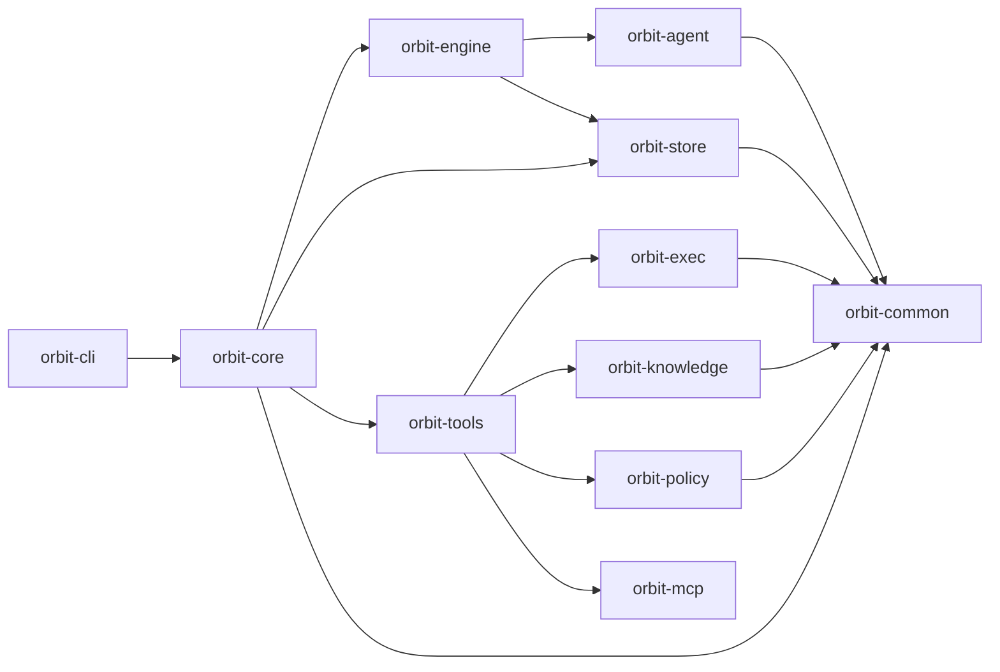

# Orbit — The audit log for your AI coding agents

<p align="center">
  
</p>

<p align="center">
  <em>The Orbit dashboard (<code>orbit web serve</code>) — task backlog, live audit log, per-agent scoreboard.</em>
</p>

**Orbit is a durable, intent-tracked, auditable task layer for developers driving AI coding agents at high volume — local-first by design, with a path to team-scale automation as trust in agents matures.**

You drive multiple coding agents (Claude Code, Cursor, Aider, Codex CLI) against real code. Ideas accumulate faster than any session can hold, work spans branches and weeks, and six months from now you have to remember *why* an agent wrote a given line. Agent vendors solve in-session execution. Orbit is the layer above — local-first state that turns individual agent sessions into a coherent, auditable body of work.

Full positioning, commercial model, and roadmap: [docs/POSITIONING.md](docs/POSITIONING.md).

---

## Primary Features

- **Durable, intent-tracked task layer.** Lifecycle (`proposed → backlog → in-progress → review → done`) survives sessions, branches, and weeks. Every commit carries the `task_id`; `orbit task show` reconstructs prompt, plan, execution trace, and review threads months later.

- **Auditability.** Every tool call, provider request/response, and task transition is a structured, queryable event with agent identity attached. Append-only, tamper-evident, exportable. → [docs/design/auditability/](docs/design/auditability/)

- **Knowledge-graph–aware tooling.** Agents query a parsed, content-addressed graph (symbols, imports, callers, implementors) instead of grep. Branch-scoped, safe for parallel rebuild. The graph is what makes audit cheap to populate; benchmark in [`benchmarks/graph/`](benchmarks/graph/). → [docs/design/knowledge-graph/](docs/design/knowledge-graph/)

- **Conflict-aware parallel execution.** Agents reserve explicit locks on files or code regions they intend to edit (`orbit task locks reserve`) before dispatch. Overlapping reservations are rejected up front instead of producing merge conflicts later; locks auto-release when their owning run reaches a terminal state. → [docs/design/activity-job/](docs/design/activity-job/)


---

## Quick Start

**Prerequisites:** at least one supported agent CLI (Codex, Claude Code, or Gemini CLI), authenticated. For PR-based execution, `gh` installed and authenticated; otherwise use `--mode local`.

```bash
# install
curl -sSf https://raw.githubusercontent.com/danieljhkim/orbit/agent-main/install.sh | sh
# or: brew install danieljhkim/tap/orbit
# or, in Claude Code:
#   /plugin marketplace add danieljhkim/orbit
#   /plugin install orbit

# initialize
orbit init                                 # global state (~/.orbit)
cd <repo> && orbit workspace init --mcp    # workspace state + MCP integration

# create, approve, and ship a task
TASK_ID=$(orbit task add \
  --title "..." \
  --description "..." \
  --acceptance-criteria "..." \
  --workspace .)
orbit task approve "$TASK_ID"

orbit run ship-auto      # conflict-aware flush of the backlog tasks to PR

orbit web serve          # launch interactive dashboard
```

Full command reference: `orbit --help` and [orbit-cli.com](https://orbit-cli.com).

---

## Core Model

- **Task** — durable unit of work, versioned and auditable, scoped to a workspace.
- **Knowledge graph** — parsed structure of your codebase. Branch-scoped; safe for parallel rebuild.
- **Worktree** — each agent session runs in an isolated git worktree.
- **Locks** — explicit claims on files or code regions; reserved before dispatch to prevent overlapping edits.

Substrate primitives (`activity`, `job`, `policy`, `executor`, `tool`) are inspectable on purpose but not the product story.

---

## Architecture

Layered Rust crates. Lower layers do not depend on higher layers.



`orbit-knowledge` provides the graph substrate; `orbit-engine` and `orbit-agent` provide the execution substrate. v1 ships `backend: cli` (CLI-subprocess providers under `orbit-agent::providers/*`). Design docs: [docs/design/](docs/design/).

> **Platform:** OS-level sandbox enforcement is **macOS only** (via `sandbox-exec`). On Linux/Windows, FS policies still apply as in-process guards for HTTP-tool calls; the spawned agent subprocess runs without OS-level isolation.

---

## Current Status

Orbit is v0.3.x — work in progress.

- Core local execution, graph build/query, and audit infrastructure are usable today.
- The execution substrate shows more internal machinery than the final product should; some historical CLI surfaces remain even though they're no longer central.
- Production or multi-machine deployments are not yet recommended.

Intentional technical debt on the path toward a tighter product focused on the audit and task layer.

---

## Commercial Model

OSS (this repo, MIT/Apache 2.0) is the full solo-wedge experience — free forever for self-hosted individuals and small teams. **Orbit Team** is a planned hosted multi-tenant SKU for engineering organizations. Full structure: [POSITIONING § Commercial model](docs/POSITIONING.md#commercial-model-open-core-two-tiers).

---

## Contributing

Contributions especially welcome on graph-aware scheduling, locking, worktree/session management, execution primitives, reconciliation, audit coverage, and tool-calling interfaces.

Before contributing: [docs/design/CONVENTIONS.md](docs/design/CONVENTIONS.md) and [CLAUDE.md](CLAUDE.md).
