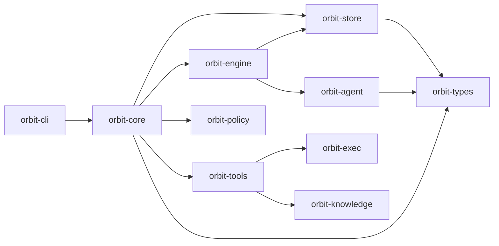

# Orbit: Graph-Aware Parallel Execution For Coding Agents

Orbit is a local-first control plane for running multiple coding agents safely in parallel inside a repository.

It sits on top of agent CLIs such as Codex, Claude Code, and Gemini CLI. Orbit does not try to be the model layer, and it does not need provider API keys of its own.

The core idea is simple:

1. Take a goal.
2. Understand the code graph.
3. Partition the work into safe shards.
4. Launch agent sessions with explicit claims.
5. Reconcile the results.

Existing workflow engines are good at durable control flow. They are not, by themselves, a complete answer to graph-aware parallel agent execution in a live codebase. Orbit is focused on that gap.

---

## What Orbit Is

Orbit should be understood through four public concepts:

- **Goal**: the change you want in the repository.
- **Graph**: the code-aware structure Orbit uses to reason about dependencies and boundaries.
- **Session**: an agent worker running against an isolated workspace or worktree.
- **Locks**: explicit claims that prevent overlapping or unsafe parallel edits.

Today, some of this model is still expressed through lower-level implementation surfaces such as tasks, jobs, and activities. Those remain in the repository because Orbit still needs durable execution state and scheduling primitives. They are the substrate, not the product story.

---

## Quick Start

**Prerequisites**: Codex CLI, Claude Code, or Gemini CLI

Orbit itself can be installed without Rust. Only source builds require a Rust toolchain.

For the default PR-based execution path (`orbit run ship`), you also need the GitHub CLI (`gh`) installed and authenticated. If you do not want to use GitHub or open pull requests, use `orbit run ship local` instead.

```bash
# install via curl | sh (macOS and Linux)
curl -sSf https://raw.githubusercontent.com/danieljhkim/orbit/main/install.sh | sh

# or install via Homebrew (macOS)
brew install danieljhkim/tap/orbit

# or build from source
git clone https://github.com/danieljhkim/orbit.git
cd orbit
make install

# initialize global Orbit state (~/.orbit)
orbit init

# initialize workspace-local Orbit state inside a repository
cd <repo>
orbit workspace init

# build the code graph
orbit graph build

# today, goals are still represented internally as Orbit tasks
# one easy path is to ask an agent to draft them for you
"Create an orbit task for <goal>"

# review and approve the proposed execution shard(s)
orbit task list
orbit task show <task_id>
orbit task approve <task_id> --note "LGTM"

# run the default PR-based execution path
orbit run ship

# or run a local-only execution path
orbit run ship local
```

If you already know which shard(s) you want to run, pin them explicitly:

```bash
orbit run ship T123 T456 --parallelism 2 --base main
```

Pinned installs and custom install directories are supported:

```bash
curl -sSf https://raw.githubusercontent.com/danieljhkim/orbit/main/install.sh | ORBIT_VERSION=v0.1.0 sh
curl -sSf https://raw.githubusercontent.com/danieljhkim/orbit/main/install.sh | ORBIT_INSTALL_DIR="$HOME/.local/bin" sh
```

---

## Why Orbit Exists

The hard problem is not "how do I run steps in order?" We already have strong tools for that.

The hard problem is:

- how to split a code change into parallelizable shards
- how to decide which shards can safely run at the same time
- how to keep agent sessions from colliding on files or code regions
- how to recover when parallel work conflicts anyway
- how to do all of that with durable local state instead of hidden SaaS state

Orbit is aimed at that problem.

---

## Current Mental Model vs Current CLI

Orbit's long-term public model is:

- `goal`
- `graph`
- `session`
- `locks`

Orbit's current CLI still exposes lower-level surfaces because the implementation is not fully collapsed into that model yet:

- `task`: today's durable goal or shard representation
- `job` / `activity`: execution substrate
- `policy`: filesystem guardrails for agent execution
- `tool`: Orbit-native and MCP-facing integration surface

Use the public model to understand Orbit. Use the current CLI to operate it.

---

## Core Flow Today

The current high-level path is:

1. Build or update the repository graph with `orbit graph ...`.
2. Represent a goal as one or more Orbit tasks.
3. Let Orbit dispatch agent work through `orbit run ship` or `orbit run ship local`.
4. Let Orbit manage worktrees, claims, and reconciliation internally.

The user-visible task surface exists today because Orbit still needs a durable unit for distributing work across agent sessions. Treat tasks as execution shards, not as the main reason Orbit exists.

---

## Graph-Aware Scheduling

Orbit already contains the pieces that matter most to its thesis:

- code graph build and query via `orbit graph`
- automatic task bundling and fan-out dispatch
- gate pipelines that wait for safe execution windows
- explicit task lock reservation before dispatch
- isolated worktree-based execution for bundles

This is the direction of the product: not generic workflow authoring, but graph-aware scheduling and conflict management for parallel coding agents.

---

## Primary Commands

These are the most important surfaces today:

### Graph

```bash
orbit graph build
orbit graph update
orbit graph search <query>
orbit graph show <selector>
```

Use these to build and inspect the code-aware structure Orbit uses for partitioning and scheduling.

### Execution

```bash
orbit run ship
orbit run ship <task_id> ...
orbit run ship local
orbit reconcile
```

- `ship` runs the default PR-based execution path.
- `ship local` runs a local-only execution path with no PR loop.
- `reconcile` helps recover pending or running workflow state.

### Current Goal Surface

```bash
orbit task list
orbit task show <task_id>
orbit task approve <task_id>
orbit task update <task_id> ...
```

This is the current durable surface for goal and shard state until Orbit grows a dedicated public `goal` UX.

---

## Advanced And Internal Surfaces

Orbit still exposes several lower-level command groups because they are part of the current runtime substrate:

```text
orbit [OPTIONS] <COMMAND>

Setup:
  init
  workspace
  config

Primary:
  graph
  task
  run
  reconcile

Advanced / Internal:
  activity
  job
  policy
  executor
  tool
  audit
  metrics
  scoreboard
  serve
```

These surfaces exist because Orbit still needs an inspectable local runtime. They should not be read as the core product thesis.

---

## Workspace Model

Orbit artifacts have two scopes:

- **Global scope**: initialized via `orbit init`, usually under `~/.orbit/`
- **Workspace scope**: initialized via `orbit workspace init`, under `<repo>/.orbit/`

Typical workspace-local state lives under `.orbit/`:

```text
.orbit/
├── diagnostics/      # Runtime diagnostics and health checks
├── jobs/             # Job definitions and immutable run logs
├── knowledge/        # Code graph artifacts
├── scoreboard/       # Derived metrics and historical artifacts
└── tasks/            # Durable goal/shard state
```

Scoping rules matter:

- tasks, job runs, and scoreboards are workspace-local
- graph artifacts are workspace-local
- activities and jobs can merge from global defaults with workspace overrides
- policies provide filesystem-scoped execution guardrails
- audit remains globally scoped

---

## Filesystem Guardrails

Orbit uses filesystem-scoped policies to control what agent execution can read and modify.

A v2 activity can opt into a named filesystem profile with `fsProfile`; if it omits the field, Orbit resolves an implicit unrestricted profile and still applies global deny rules.

Short example:

```yaml
# activity
schemaVersion: 2
kind: Activity
metadata:
  name: agent_review_diff
spec:
  type: agent_loop
  fsProfile: reviewer
  instruction: Review the diff without modifying workspace files.
```

```yaml
# policy
schemaVersion: 2
kind: Policy
metadata:
  name: default
spec:
  denyRead:
    - "**/*.env"
  denyModify:
    - .orbit/**
    - "**/*.env"
  fsProfiles:
    reviewer:
      read: [./**]
      modify: []
```

This guardrail model matters because Orbit's core problem is safe parallel execution, not just prompt routing.

---

## Architecture

Orbit is structured as a layered set of Rust crates. Lower layers do not depend on higher layers.



Two details matter most:

- `orbit-knowledge` provides the graph substrate
- `orbit-engine` and `orbit-agent` provide the execution substrate

That is the center of gravity for Orbit.

---

## MCP And External Tools

Orbit can expose enabled external tools through `orbit serve mcp`, making them available alongside Orbit's built-in tool surface.

The easiest path is to scaffold a starter plugin and register it:

```bash
orbit tool scaffold ./plugins/hello_orbit.py --name demo.hello
orbit tool add ./plugins/hello_orbit.py
orbit tool show demo.hello
orbit serve mcp
```

This is useful, but it is not the main product thesis. MCP support is an integration layer, not Orbit's moat.

---

## What Orbit Is Not

Orbit is not trying to be:

- a foundation model provider
- a generic workflow engine in the style of Temporal
- a general agent orchestration canvas in the style of LangGraph
- a replacement for GitHub, Jira, or Linear
- a generic task manager as the primary product

Orbit is best understood as a serious local runtime for graph-aware parallel coding-agent execution.

---

## Current Status

Orbit is still a work in progress.

- core local execution primitives are usable today
- graph build and query are available today
- the execution substrate still shows more of its internal machinery than the final product should
- some historical surfaces remain in the CLI even though they are no longer central
- production or multi-machine deployments are not yet recommended

The current repository contains more workflow and task machinery than the long-term public story should emphasize. That is intentional technical debt on the path toward a tighter product focused on graph-aware agent scheduling.

---

## Contributing

Contributions focused on graph-aware scheduling, locking, worktree/session management, execution primitives, reconciliation, and tool-calling interfaces are especially welcome.

Open an issue or submit a pull request for review.
