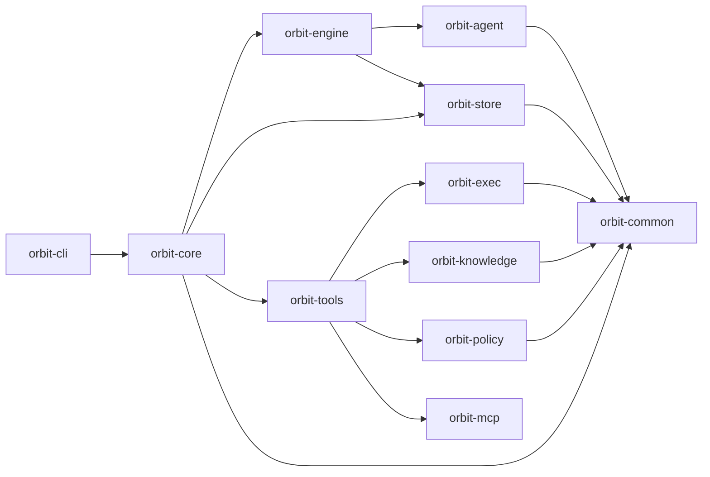

# Orbit: Graph-Aware Parallel Execution For Coding Agents

**Orbit is a self-hosted runtime for running fleets of coding agents against your team's real codebase** — with an auditable trail, a code-aware graph, and explicit locks that keep parallel agent sessions from stepping on each other.

It is built for the staff engineer or platform lead at a team of roughly 10–50 engineers who has decided that LLM-driven automation (PR review, refactor passes, backlog execution, cross-cutting migrations) is worth running at team scale and wants infrastructure they can actually rely on.

If you are a solo developer augmenting personal workflow, Claude Code / Cursor / Aider / Codex CLI already serve you well. If you are an enterprise procurement buyer, Orbit is the wrong product. Orbit sits in the middle — the team-scale space where individual-developer tooling breaks down and enterprise platforms are overkill.

The full positioning — who Orbit is for, what it refuses to become, and the decision lens we use when design debates get stuck — lives in [docs/POSITIONING.md](docs/POSITIONING.md). Read it if you're evaluating Orbit or contributing.

---

## Primary Features

Two features carry the product thesis. Everything else in Orbit is infrastructure that makes these two reliable.

### Knowledge graph — *available today*

Agents inspect a parsed, content-addressed graph of your codebase: directories, files, extracted symbols, import edges, crate dependencies, trait implementors, and signature-matched caller/reference indexes. Queries are token-budgeted packs shaped for prompt consumption, not LSP-style hover text.

The graph is built for safe parallel execution. It is branch-scoped (two worktrees on two branches rebuild concurrently without corruption), task attribution from commit messages is carried on every node (`[T20260421-0528]`), and reads fall back to the default branch until a new branch has been built. The public graph surface is read-only; write coordination happens before dispatch through task `context_files` and `orbit.task.locks.reserve` preflight guards.

This is the technical moat and the reason to pick Orbit over a generic agent framework. Design docs: [docs/design/knowledge-graph/](docs/design/knowledge-graph/).

### Auditability — *available today*

Every tool call, provider request/response, and task-state transition is a structured, queryable event with agent identity attached. When something goes sideways on your team's monorepo, you answer *what / why / who* without calling the Orbit maintainers. Append-only, tamper-evident, exportable.

Full contract below in the [Auditability](#auditability) section. Design docs: [docs/design/auditability/](docs/design/auditability/).

---

## Direction of travel

The substrate also hosts work that is not yet a front-door product surface but signals where Orbit is headed:

- **Groundhog** — a checkpoint-oriented execution mode for HTTP-backend agents. Work runs as a sequence of checkpoints; each attempt starts with a fresh agent context and a clean git-backed workspace snapshot, then either rewinds on failure or persists a small stable memory on success. Today it exists as an `ActivityV2Spec::Groundhog` activity behind the job layer, not as an `orbit run` subcommand. Status: [docs/design/groundhog/](docs/design/groundhog/).

---

## Non-negotiables

Tablestakes for the primary audience. Orbit will not ship anything that breaks them.

- **Self-hostable, no cloud dependency.** Single binary, runs on a laptop, in a container, in a CI runner, behind a firewall. Orbit never phones home.
- **Bring-your-own-credentials.** Your Anthropic / OpenAI / local-model keys, never Orbit's. Orbit is a pass-through.
- **HTTP/SDK-first provider communication.** Programmatic multi-turn is the backbone. CLI subprocess execution (Codex, Claude Code, Gemini CLI) is retained as an escape hatch for experimentation, not the default path.
- **Fleet primitives.** Parallel task execution, cross-provider delegation, per-agent scoreboards, per-agent commit identity. Single-assistant assumptions are incorrect.
- **Git- and GitHub-native.** Branches, worktrees, PRs, CI status. No custom version control abstractions.
- **Cost-visible.** You know what each run cost in tokens and wall-clock — see `orbit audit stats` and `orbit metrics`.
- **Configurable, not rigid.** Job DAGs, activity definitions, skill loadouts, role profiles are all YAML. Fork, don't file feature requests.

---

## The Core Model

Orbit is built around four concepts you will actually touch:

- **Task** — the durable unit of work. You create one, approve it, and let Orbit dispatch agents against it. Tasks are versioned, auditable, and scoped to a workspace.
- **Knowledge graph** — the parsed structure of your codebase. Agents query it instead of grep-ing. It is what makes parallel scheduling safe and what distinguishes Orbit from a generic agent framework.
- **Worktree** — each agent session runs in an isolated git worktree so parallel work does not stomp on your checkout. Reconciliation happens when the agent finishes.
- **Locks** — explicit claims on files or code regions that prevent overlapping parallel edits. A task reserves its locks before dispatch; if the reservation would conflict, the task waits.

Supporting primitives (`activity`, `job`, `policy`, `executor`, `tool`) are the substrate those four concepts run on. They are inspectable on purpose — Orbit's audit thesis requires it — but they are not the product story.

---

## Quick Start

**Prerequisites**: an LLM provider API key (Anthropic / OpenAI / local model), plus optional agent CLIs (Codex, Claude Code, Gemini CLI) if you want to experiment with the CLI backend.

Orbit itself can be installed without Rust. Only source builds require a Rust toolchain.

For the default PR-based execution path (`orbit run ship`), you also need the GitHub CLI (`gh`) installed and authenticated. If you do not want to use GitHub or open pull requests, use `orbit run ship --mode local` instead.

```bash
# install via curl | sh (macOS and Linux)
curl -sSf https://raw.githubusercontent.com/danieljhkim/orbit/main/install.sh | sh

# or install via Homebrew (macOS)
brew install danieljhkim/tap/orbit

# or build from source
git clone https://github.com/danieljhkim/orbit.git
cd orbit
make install

# initialize global Orbit state (~/.orbit), global skills, and user-level skill links
orbit init

# initialize workspace-local Orbit state inside a repository
cd <repo>
orbit workspace init
# or skip MCP client auto-detection / setup
orbit workspace init --no-mcp

# build the code graph
orbit graph build

# create a task for the work you want done (prints the new task ID)
TASK_ID=$(orbit task add \
  --title "Create orbit-hello.txt" \
  --description "Add orbit-hello.txt at the repository root containing the text 'hello from orbit'." \
  --acceptance-criteria "orbit-hello.txt exists at the repository root." \
  --acceptance-criteria "orbit-hello.txt contains the text 'hello from orbit'." \
  --workspace .)
echo "$TASK_ID"

# review and approve the created proposed task
orbit task list --status proposed
orbit task show "$TASK_ID"
orbit task approve "$TASK_ID"

# run the default PR-based execution path
orbit run ship "$TASK_ID"

# or run a local-only execution path
orbit run ship --mode local "$TASK_ID"
```

If you prefer conversational drafting, ask an agent to produce the `orbit task add ...` command for your real task, then run that command and continue with the same review + ship flow.

If you already know which task(s) you want to run, pin them explicitly:

```bash
orbit run ship T123 T456 --base main
```

Pinned installs and custom install directories are supported:

```bash
curl -sSf https://raw.githubusercontent.com/danieljhkim/orbit/main/install.sh | ORBIT_VERSION=v0.1.0 sh
curl -sSf https://raw.githubusercontent.com/danieljhkim/orbit/main/install.sh | ORBIT_INSTALL_DIR="$HOME/.local/bin" sh
```

---

## Why Orbit Exists

The hard problem is not "how do I run steps in order?" Durable workflow engines (Temporal, Airflow) already solve that.

The hard problem is:

- how to split a code change into parallelizable tasks
- how to decide which tasks can safely run at the same time
- how to keep agent sessions from colliding on files or code regions
- how to recover when parallel work conflicts anyway
- how to do all of that with durable **local** state, under an audit trail you control, without routing your source through a third-party SaaS

Orbit is aimed at that problem.

---

## Auditability

When something goes wrong on your team's monorepo, you need to answer three questions without calling the Orbit maintainers: **what** the agent did, **why** it did that, and **who** is accountable. Every tool call, provider request/response, and task-state transition is a structured, queryable event with agent identity attached. Audit is append-only and tamper-evident; prompts and responses are stored verbatim with configurable redaction.

When auditability conflicts with performance, ergonomics, or feature surface, auditability wins.

The full contract — coverage commitments, schema stability, reproducibility, tamper-evidence — lives in [docs/POSITIONING.md](docs/POSITIONING.md#primary-focus-auditability). Query command audit rows with `orbit audit list`, `orbit audit show`, and `orbit audit stats`. Inspect run-local activity/job traces with `orbit run events <run_id>` and `orbit run trace <run_id>`.

---

## Graph-Aware Scheduling

Orbit already contains the pieces that matter most to its thesis:

- code graph build and query via `orbit graph`
- automatic task bundling and fan-out dispatch
- gate pipelines that wait for safe execution windows
- explicit task lock reservation before dispatch
- isolated worktree-based execution for bundles

The knowledge graph is described in [docs/design/knowledge-graph/](docs/design/knowledge-graph/). It is not generic workflow authoring — it is graph-aware scheduling and conflict management for parallel coding agents.

---

## Primary Commands

### Graph

```bash
orbit graph build
orbit graph update
orbit graph search <query>
orbit graph show <selector>
```

Build and inspect the code-aware structure Orbit uses for partitioning and scheduling.

### Execution

```bash
orbit run ship <task_id> ...
orbit run ship --mode local <task_id> ...
orbit run ship-auto
orbit run duel-plan <task_id>
orbit run job <job_id>
orbit run show [run_id]
orbit run logs [run_id]
orbit run events [run_id]
orbit run trace [run_id]
```

- `ship` runs explicitly selected tasks through the PR pipeline by default.
- `ship --mode local` runs explicitly selected tasks through the local-only path.
- `ship-auto` auto-selects backlog tasks and dispatches them through the same PR/local mode switch.
- `duel-plan` runs the planning-duel workflow for one task.
- `show`, `logs`, `events`, and `trace` inspect the most recent run by default, or a specific run ID when supplied.
- use `orbit run history -j <job_id>` and `orbit run show <run_id>` for durable job-run history and state.

### Tasks

```bash
orbit task add
orbit task list
orbit task show <task_id>
orbit task artifact put <task_id> <source_path>
orbit task approve <task_id>
```

Tasks are the durable unit of work. Newly created tasks enter `proposed`; `approve` moves proposed work into the backlog and approves completed review work into done.

### Audit and Observability

```bash
orbit audit list
orbit audit show <event_id>
orbit audit stats
orbit run events <run_id>
orbit run trace <run_id>
```

Every agent action is queryable. `orbit audit` reads compact command-audit rows; `orbit run events` and `orbit run trace` read workspace-local activity/job run traces from `.orbit/state/audit/`. Treat this as a first-class surface, not a debug tool.

---

## Operating Surfaces

### Workspace state

Orbit artifacts have two scopes: **global** (initialized via `orbit init`, under `~/.orbit/`) and **workspace** (initialized via `orbit workspace init`, under `<repo>/.orbit/`).

```text
.orbit/
├── knowledge/        # Code graph artifacts
├── resources/        # Workspace overrides for activities, jobs, policies, executors, skills
├── state/            # Audit traces, diagnostics, job runs, scoreboards, worktrees
└── tasks/            # Durable task state
```

Tasks, job runs, scoreboards, and run traces are workspace-local. Graph artifacts are workspace-local and branch-scoped. Activities, jobs, policies, and skills merge global defaults with workspace overrides. Default skills are initialized under `~/.orbit/skills` and linked into `~/.agents/skills` and `~/.claude/skills`. Command audit events live globally in SQLite.

### Filesystem guardrails

Orbit uses filesystem-scoped policies to control what agent execution can read and modify — safe parallel execution is the core problem, not just prompt routing. A v2 activity can opt into a named filesystem profile with `fsProfile`; if it omits the field, Orbit resolves an implicit unrestricted profile and still applies global deny rules. Design docs: [docs/design/policy-sandbox/](docs/design/policy-sandbox/).

```yaml
schemaVersion: 2
kind: Policy
metadata:
  name: default
spec:
  denyRead:
    - "**/*.env"
  denyModify:
    - .orbit/**
    - "**/*.env"
  fsProfiles:
    reviewer:
      read: [./**]
      modify: []
```

### MCP integration

Orbit exposes a safe MCP surface by default: `orbit.task.*` tools and graph read tools (`orbit.graph.search`, `orbit.graph.show`, `orbit.graph.pack`). No graph write tools — write coordination flows through task lock reservations such as `orbit.task.locks.reserve`.

```bash
orbit mcp init --auto    # detects .claude/, .gemini/, ~/.codex/config.toml
orbit mcp init --claude  # writes ~/.claude/.mcp.json + .claude/settings.json
orbit mcp init --codex   # writes .codex/config.toml (repo must be trusted in Codex)
orbit mcp init --gemini  # writes .gemini/settings.json
orbit mcp serve
```

`.claude/settings.local.json` and `~/.gemini/settings.json` are user override layers and are never modified. MCP support is an integration layer, not Orbit's moat.

### Advanced surfaces

Lower-level operating surfaces are intentionally available because durable local state is part of the product:

- `activity` and `job` for defining and running substrate assets directly
- `policy`, `executor`, and `tool` for runtime customization
- `orbit scoreboard`, `orbit run history -j <job_id>`, `orbit run show/logs/events/trace`, and `orbit run job <id>` for evaluation, history, trace inspection, and direct workflow execution
- `metrics` and `serve` for observability and outward integration

Most users can ignore these on day one. Reach for `orbit --help` and `orbit <command> --help` when you need the deeper surface area.

---

## Architecture

Orbit is structured as a layered set of Rust crates. Lower layers do not depend on higher layers.



Two details matter most:

- **`orbit-knowledge`** provides the graph substrate. Design docs in [docs/design/knowledge-graph/](docs/design/knowledge-graph/).
- **`orbit-engine`** and **`orbit-agent`** provide the execution substrate. HTTP `LoopTransport` is primary; CLI subprocess providers are retained as the `backend: cli` path. Design docs in [docs/design/activity-job/](docs/design/activity-job/) and [docs/design/groundhog/](docs/design/groundhog/).

That is the center of gravity for Orbit.

---

## Current Status

Orbit is a work in progress.

- core local execution primitives are usable today
- graph build and query are available today
- audit infrastructure is live; coverage still expanding
- the execution substrate shows more internal machinery than the final product should
- some historical surfaces remain in the CLI even though they are no longer central
- production or multi-machine deployments are not yet recommended — we expect to lift this once audit coverage is complete and the lower-level activity/job surfaces are folded behind the task and graph product surfaces

The repository currently contains more workflow and task machinery than the long-term public story should emphasize. That is intentional technical debt on the path toward a tighter product focused on graph-aware agent scheduling.

---

## Contributing

Contributions focused on **graph-aware scheduling, locking, worktree/session management, execution primitives, reconciliation, audit coverage, and tool-calling interfaces** are especially welcome.

Before contributing, read:

- [docs/design/CONVENTIONS.md](docs/design/CONVENTIONS.md) — design doc conventions (required reading if you touch `docs/design/`)
- [CLAUDE.md](CLAUDE.md) — project-wide instructions for human and agent contributors

Open an issue or submit a pull request for review.
