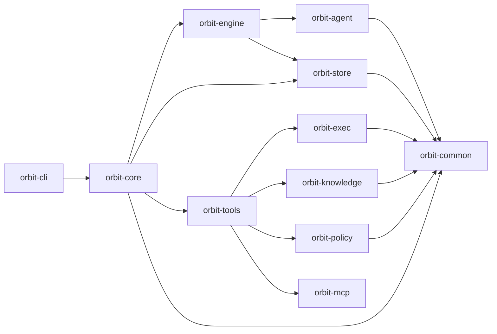

# Orbit: Graph-Aware Parallel Execution For Coding Agents

**Orbit is a self-hosted runtime for running fleets of coding agents against your team's real codebase** — with an auditable trail, a code-aware graph, and explicit locks that keep parallel agent sessions from stepping on each other.

It is built for the staff engineer or platform lead at a team of roughly 3–50 engineers who has decided that LLM-driven automation (PR review, refactor passes, backlog execution, cross-cutting migrations) is worth running at team scale and wants infrastructure they can actually rely on.

If you are a solo developer augmenting personal workflow, Claude Code / Cursor / Aider / Codex CLI already serve you well. If you are an enterprise procurement buyer, Orbit is the wrong product. Orbit sits in the middle — the team-scale space where individual-developer tooling breaks down and enterprise platforms are overkill.

The full positioning — who Orbit is for, what it refuses to become, and the decision lens we use when design debates get stuck — lives in [docs/POSITIONING.md](docs/POSITIONING.md). Read it if you're evaluating Orbit or contributing.

---

## Primary Features

Three features carry the product thesis. Everything else in Orbit is infrastructure that makes these three reliable.

### Knowledge graph — *available today*

Agents operate against a parsed, content-addressed graph of your codebase: directories, files, extracted symbols, import edges, trait implementors, call sites. Queries are token-budgeted packs shaped for prompt consumption, not LSP-style hover text. The graph is branch-scoped (two worktrees on two branches rebuild concurrently without corruption), attribute history from commit messages is carried on every node (`[T20260421-0528]`), and reads fall back to the default branch until a new branch has been built.

This is the technical moat and the reason to pick Orbit over a generic agent framework. Design docs: [docs/design/knowledge-graph/](docs/design/knowledge-graph/).

### Auditability — *available today*

Every tool call, provider request/response, and task-state transition is a structured, queryable event with agent identity attached. When something goes sideways on your team's monorepo, you answer *what / why / who* without calling the Orbit maintainers. Append-only, tamper-evident, exportable.

Full contract below in the [Auditability](#auditability) section.

### Groundhog — *experimental, behind the job surface*

A checkpoint-oriented execution mode for HTTP-backend agents. Instead of one long agent session, work runs as a sequence of **checkpoints**; each attempt starts with a fresh agent context and a clean git-backed workspace snapshot, then either rewinds on failure or persists a small stable memory on success.

Groundhog is not a front-door CLI feature yet — today it exists as an `ActivityV2Spec::Groundhog` activity behind the job layer. Current status lives in [docs/design/groundhog/](docs/design/groundhog/); treat it as a direction of travel, not the main reason to evaluate Orbit on day one.

---

## Non-negotiables

Tablestakes for the primary audience. Orbit will not ship anything that breaks them.

- **Self-hostable, no cloud dependency.** Single binary, runs on a laptop, in a container, in a CI runner, behind a firewall. Orbit never phones home.
- **Bring-your-own-credentials.** Your Anthropic / OpenAI / local-model keys, never Orbit's. Orbit is a pass-through.
- **HTTP/SDK-first provider communication.** Programmatic multi-turn is the backbone. CLI subprocess execution (Codex, Claude Code, Gemini CLI) is retained as an escape hatch for experimentation, not the default path.
- **Fleet primitives.** Parallel task execution, cross-provider delegation, per-agent scoreboards, per-agent commit identity. Single-assistant assumptions are incorrect.
- **Git- and GitHub-native.** Branches, worktrees, PRs, CI status. No custom version control abstractions.
- **Cost-visible.** You know what each run cost in tokens and wall-clock.
- **Configurable, not rigid.** Job DAGs, activity definitions, skill loadouts, role profiles are all YAML. Fork, don't file feature requests.

---

## The Core Model

Orbit is built around four concepts you will actually touch:

- **Task** — the durable unit of work. You create one, approve it, and let Orbit dispatch agents against it. Tasks are versioned, auditable, and scoped to a workspace.
- **Knowledge graph** — the parsed structure of your codebase. Agents query it instead of grep-ing. It is what makes parallel scheduling safe and what distinguishes Orbit from a generic agent framework.
- **Worktree** — each agent session runs in an isolated git worktree so parallel work does not stomp on your checkout. Reconciliation happens when the agent finishes.
- **Locks** — explicit claims on files or code regions that prevent overlapping parallel edits. A task reserves its locks before dispatch; if the reservation would conflict, the task waits.

Supporting primitives (`activity`, `job`, `policy`, `executor`, `tool`) are the substrate those four concepts run on. They are inspectable on purpose — Orbit's audit thesis requires it — but they are not the product story.

---

## Quick Start

**Prerequisites**: an LLM provider API key (Anthropic / OpenAI / local model), plus optional agent CLIs (Codex, Claude Code, Gemini CLI) if you want to experiment with the CLI backend.

Orbit itself can be installed without Rust. Only source builds require a Rust toolchain.

For the default PR-based execution path (`orbit run ship`), you also need the GitHub CLI (`gh`) installed and authenticated. If you do not want to use GitHub or open pull requests, use `orbit run ship local` instead.

```bash
# install via curl | sh (macOS and Linux)
curl -sSf https://raw.githubusercontent.com/danieljhkim/orbit/main/install.sh | sh

# or install via Homebrew (macOS)
brew install danieljhkim/tap/orbit

# or build from source
git clone https://github.com/danieljhkim/orbit.git
cd orbit
make install

# initialize global Orbit state (~/.orbit)
orbit init

# initialize workspace-local Orbit state inside a repository
cd <repo>
orbit workspace init
# or skip MCP client auto-detection / setup
orbit workspace init --no-mcp

# build the code graph
orbit graph build

# create a task for the work you want done (prints the new task ID)
TASK_ID=$(orbit task add \
  --title "Create orbit-hello.txt" \
  --description "Add orbit-hello.txt at the repository root containing the text 'hello from orbit'." \
  --acceptance-criteria "orbit-hello.txt exists at the repository root." \
  --acceptance-criteria "orbit-hello.txt contains the text 'hello from orbit'." \
  --workspace .)
echo "$TASK_ID"

# review and approve the proposed task(s)
orbit task list
orbit task show "$TASK_ID"
orbit task approve "$TASK_ID" --note "LGTM"

# run the default PR-based execution path
orbit run ship "$TASK_ID"

# or run a local-only execution path
orbit run ship local "$TASK_ID"
```

If you prefer conversational drafting, ask an agent to produce the `orbit task add ...` command for your real task, then run that command and continue with the same approval + ship flow.

If you already know which task(s) you want to run, pin them explicitly:

```bash
orbit run ship T123 T456 --parallelism 2 --base main
```

Pinned installs and custom install directories are supported:

```bash
curl -sSf https://raw.githubusercontent.com/danieljhkim/orbit/main/install.sh | ORBIT_VERSION=v0.1.0 sh
curl -sSf https://raw.githubusercontent.com/danieljhkim/orbit/main/install.sh | ORBIT_INSTALL_DIR="$HOME/.local/bin" sh
```

---

## Why Orbit Exists

The hard problem is not "how do I run steps in order?" Durable workflow engines (Temporal, Airflow) already solve that.

The hard problem is:

- how to split a code change into parallelizable tasks
- how to decide which tasks can safely run at the same time
- how to keep agent sessions from colliding on files or code regions
- how to recover when parallel work conflicts anyway
- how to do all of that with durable **local** state, under an audit trail you control, without routing your source through a third-party SaaS

Orbit is aimed at that problem.

---

## Auditability

When something goes wrong — a bad merge, a regression, a mystery refactor — you need to answer three questions without calling the Orbit maintainers:

1. **What did the agent do, exactly?** Every tool call, every provider request/response, every task state transition is recorded with enough fidelity to reconstruct the sequence.
2. **Why did it do that?** The prompt, system instructions, role configuration, and surrounding context are recoverable, not just the action.
3. **Who is accountable?** Agent identity, model, provider, and activity context are attached to every event — on commits, on PRs, on audit entries — so a git blame or audit query reaches a concrete agent identity, not "the AI."

Concrete commitments:

- **Coverage is broad and expanding.** Orbit is aiming for complete coverage across code, state, and external-service operations. Silent paths are treated as bugs.
- **Structured, queryable events.** Not log strings. Typed records with stable schemas you can query via `orbit audit ...` and `orbit.audit.*` tools, or export to your own observability stack.
- **Faithful reproducibility.** Prompts and responses are stored verbatim (with configurable redaction for sensitive paths). Summaries are derived artifacts, not replacements.
- **Tamper-evident retention.** Audit is append-only. The audit trail's own integrity is verifiable; corrupting history is not a silent operation.
- **Agent-identity attribution.** Every write — commit, PR, audit event, task update — carries the identity of the agent (and model) that produced it. No anonymous AI actions.

When auditability conflicts with performance, ergonomics, or feature surface, auditability wins.

---

## Graph-Aware Scheduling

Orbit already contains the pieces that matter most to its thesis:

- code graph build and query via `orbit graph`
- automatic task bundling and fan-out dispatch
- gate pipelines that wait for safe execution windows
- explicit task lock reservation before dispatch
- isolated worktree-based execution for bundles

The knowledge graph is described in [docs/design/knowledge-graph/](docs/design/knowledge-graph/). It is not generic workflow authoring — it is graph-aware scheduling and conflict management for parallel coding agents.

---

## Primary Commands

### Graph

```bash
orbit graph build
orbit graph update
orbit graph search <query>
orbit graph show <selector>
```

Build and inspect the code-aware structure Orbit uses for partitioning and scheduling.

### Execution

```bash
orbit run ship
orbit run ship <task_id> ...
orbit run ship local
```

- `ship` runs the default PR-based execution path.
- `ship local` runs a local-only execution path with no PR loop.
- adding task IDs pins the run instead of auto-selecting from backlog.

### Tasks

```bash
orbit task add
orbit task list
orbit task show <task_id>
orbit task approve <task_id>
```

Tasks are the durable unit of work. Agents create, update, and complete them under audit.

### Audit and Observability

```bash
orbit audit list
orbit audit show <event_id>
orbit audit stats
```

Every agent action is queryable. Treat this as a first-class surface, not a debug tool.

---

## Advanced And Internal Surfaces

Orbit also exposes lower-level operating surfaces:

- `activity` and `job` for defining and running substrate assets directly
- `policy`, `executor`, and `tool` for runtime customization
- `orbit run duel score|list|show` and `orbit run job <id>` for evaluation history and direct workflow execution
- `metrics`, `scoreboard`, and `serve` for observability and outward integration

They are intentionally available because durable local state is part of the product, but most users can ignore them on day one. Reach for `orbit --help` and `orbit <command> --help` when you need the deeper surface area.

---

## Workspace Model

Orbit artifacts have two scopes:

- **Global scope** — initialized via `orbit init`, usually under `~/.orbit/`
- **Workspace scope** — initialized via `orbit workspace init`, under `<repo>/.orbit/`

Typical workspace-local state:

```text
.orbit/
├── diagnostics/      # Runtime diagnostics and health checks
├── jobs/             # Job definitions and immutable run logs
├── knowledge/        # Code graph artifacts (see docs/design/knowledge-graph/)
├── scoreboard/       # Derived metrics and historical artifacts
└── tasks/            # Durable task state
```

Scoping rules:

- tasks, job runs, and scoreboards are workspace-local
- graph artifacts are workspace-local, branch-scoped, and shared-object-addressed
- activities and jobs merge from global defaults with workspace overrides
- policies provide filesystem-scoped execution guardrails
- audit remains globally scoped (single authoritative event trail)

---

## Filesystem Guardrails

Orbit uses filesystem-scoped policies to control what agent execution can read and modify. Safe parallel execution is the core problem, not just prompt routing.

A v2 activity can opt into a named filesystem profile with `fsProfile`; if it omits the field, Orbit resolves an implicit unrestricted profile and still applies global deny rules.

```yaml
# activity
schemaVersion: 2
kind: Activity
metadata:
  name: agent_review_diff
spec:
  type: agent_loop
  fsProfile: reviewer
  instruction: Review the diff without modifying workspace files.
```

```yaml
# policy
schemaVersion: 2
kind: Policy
metadata:
  name: default
spec:
  denyRead:
    - "**/*.env"
  denyModify:
    - .orbit/**
    - "**/*.env"
  fsProfiles:
    reviewer:
      read: [./**]
      modify: []
```

---

## Architecture

Orbit is structured as a layered set of Rust crates. Lower layers do not depend on higher layers.



Two details matter most:

- **`orbit-knowledge`** provides the graph substrate. Design docs in [docs/design/knowledge-graph/](docs/design/knowledge-graph/).
- **`orbit-engine`** and **`orbit-agent`** provide the execution substrate. HTTP `LoopTransport` is primary; CLI subprocess providers are retained as the `backend: cli` path. Design docs in [docs/design/activity-job/](docs/design/activity-job/) and [docs/design/groundhog/](docs/design/groundhog/).

That is the center of gravity for Orbit.

---

## MCP And External Tools

Orbit exposes a safe MCP surface by default:

- all `orbit.task.*` tools
- graph read tools such as `orbit.graph.search`, `orbit.graph.show`, and `orbit.graph.pack`
- no experimental graph write tools unless you opt in with `--allow-write`

Use `orbit mcp init` to seed client integrations for the current workspace. Auto mode targets Claude when the repo already has a `.claude/` directory, Gemini when the repo already has a `.gemini/` directory, and Codex when `~/.codex/config.toml` exists. `orbit workspace init` delegates to the same auto-detect path unless you pass `--no-mcp`.

- `orbit mcp init --claude` updates the global Claude MCP registration in `~/.claude/.mcp.json` and repo-local permissions in `.claude/settings.json`. Orbit does not modify `.claude/settings.local.json`, which remains your private override layer.
- `orbit mcp init --codex` updates project-local `.codex/config.toml`. Codex only loads project config for trusted projects, so make sure the repo is trusted in Codex before expecting the MCP entry to appear in-session.
- `orbit mcp init --gemini` updates project-local `.gemini/settings.json` with an Orbit MCP server entry for the repo. Orbit does not modify `~/.gemini/settings.json`, which remains the user's global override layer.

```bash
orbit mcp init --auto
orbit mcp init --claude
orbit mcp init --codex
orbit mcp init --gemini
orbit mcp remove --all

# serve the safe default MCP surface
orbit serve mcp

# opt in experimental graph write tools
orbit serve mcp --allow-write
```

MCP support is an integration layer, not Orbit's moat.

---

## What Orbit Is Not

Orbit is deliberately not serving three audiences (see [docs/POSITIONING.md](docs/POSITIONING.md) for the reasoning):

1. **Individual developers augmenting personal workflow.** Claude Code, Cursor, Aider, Codex CLI already serve this audience well. Optimizing for them — subscription-backed backends, zero-config installs, personal-context assumptions — compromises properties the primary audience needs.
2. **Enterprise procurement buyers.** SOC 2, SSO, multi-tenant permissions, sales motions. The honest path if enterprise demand arrives is a commercial fork or partnership, not bolting enterprise surface onto the OSS core.
3. **Generic workflow orchestrators.** n8n, Airflow, LangGraph, Temporal. Orbit is specifically a coding-agent platform, not a generic workflow engine.

And Orbit is not trying to be:

- a foundation model provider
- a replacement for GitHub, Jira, or Linear
- a generic task manager as the primary product

---

## Current Status

Orbit is a work in progress.

- core local execution primitives are usable today
- graph build and query are available today
- audit infrastructure is live; coverage still expanding
- the execution substrate shows more internal machinery than the final product should
- some historical surfaces remain in the CLI even though they are no longer central
- production or multi-machine deployments are not yet recommended

The repository currently contains more workflow and task machinery than the long-term public story should emphasize. That is intentional technical debt on the path toward a tighter product focused on graph-aware agent scheduling.

---

## Contributing

Contributions focused on **graph-aware scheduling, locking, worktree/session management, execution primitives, reconciliation, audit coverage, and tool-calling interfaces** are especially welcome.

Before contributing, read:

- [docs/POSITIONING.md](docs/POSITIONING.md) — who Orbit is for, what it refuses to become
- [docs/design/CONVENTIONS.md](docs/design/CONVENTIONS.md) — design doc conventions (required reading if you touch `docs/design/`)
- [CLAUDE.md](CLAUDE.md) — project-wide instructions for human and agent contributors

Open an issue or submit a pull request for review.
