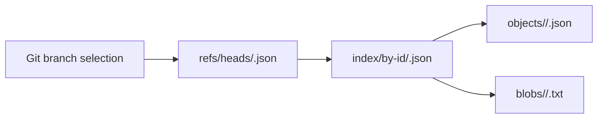

# Spec: Refs

Orbit stores the knowledge graph as a git-like split between immutable objects and mutable refs. The immutable side is shared across branches and worktrees; the mutable side is branch-scoped and records which graph snapshot should be considered "current" for a given branch.

## Why This Exists

The previous layout used a single shared ref file at `.orbit/knowledge/graph/refs/current.json`. That worked only when one branch owned the graph at a time. In real multi-branch and multi-worktree use, the last graph rebuild won globally, which caused two correctness problems:

- graph reads could answer questions about the wrong branch
- concurrent rebuilds on different worktrees could overwrite each other's active graph pointer

Branch-scoped refs fix both by making ref resolution depend on the active git branch instead of a shared mutable file.

## On-Disk Layout

Orbit stores graph data under `.orbit/knowledge/graph/`:

- `objects/<hh>/<hash>.json`
  Content-addressed graph node and root graph objects.
- `blobs/<hh>/<hash>.txt`
  Content-addressed large source blobs referenced by leaf nodes.
- `index/by-id/<root-graph-hash>.json`
  Immutable per-build index file for one graph snapshot.
- `refs/heads/<branch>.json`
  Mutable branch ref that points at the active index for that branch.

The important rule is that refs are mutable, but indexes are not. A rebuild writes a fresh index file and then atomically swings the branch ref to that new index. Orbit does not reuse a single mutable `index/by-id.json` file anymore, because that would still allow different branches to race even if refs were namespaced.

## Ref File Shape

A branch ref is JSON with the same high-level metadata as the old current ref plus an `index` field:

```json
{
  "schema_version": 1,
  "root_graph_hash": "<sha256>",
  "root_object_hash": "<sha256>",
  "root_dir_id": "dir:.",
  "git_head_oid": "<commit-oid>",
  "git_tree_oid": "<tree-oid>",
  "index": "graph/index/by-id/<root-graph-hash>.json"
}
```

The `index` field is knowledge-root-relative. That means it is interpreted relative to `.orbit/knowledge/`, not relative to `.orbit/knowledge/graph/`. This is now the single documented frame of reference for stored ref paths.

The git identity fields record the clean checkout identity used for the build. Read-side auto-refresh compares the current `HEAD` OID to `git_head_oid` before treating a branch ref as fresh; `git_tree_oid` remains available as a content identity fallback and diagnostic. Commit timestamps are not a freshness authority, because history rewrites and resets can move a branch to an older-dated commit.

## Read Resolution

Read-side callers such as `orbit graph show`, `orbit graph search`, `orbit.graph.overview`, `orbit.graph.search`, `orbit.graph.show`, `orbit.graph.refs`, `orbit.graph.pack`, `orbit.graph.callers`, and `orbit.graph.implementors` all follow the same resolution model:

1. Determine the requested ref.
   If the caller passed `--ref <name>` or `ref: "<name>"`, use that exact ref.
   Otherwise, resolve the current git branch from the workspace.
2. Determine the default branch.
   Orbit first tries `refs/remotes/origin/HEAD`, then falls back to local `main`, then local `master`.
3. Open `refs/heads/<requested>.json`.
4. If that file does not exist, and the read was using the current branch rather than an explicit override, try `refs/heads/<default>.json` instead.
5. Emit a single-line warning to stderr when a fallback happens so the caller knows the answer came from the default branch rather than the active one.
6. Resolve the index path from the ref and load the graph snapshot described by that index.

This fallback is intentionally read-only. It exists to keep the graph usable on a newly created branch before that branch has its own graph build.

## Write Resolution

`orbit graph build` and `orbit graph update` accept an optional `--ref <name>` flag. When omitted, they resolve the current git branch and write to that branch's ref.

Writes do not fall back. If Orbit cannot determine the target branch and the caller did not provide `--ref`, the command fails with a clear error.

The write sequence is:

1. Build the in-memory graph from the selected repo checkout.
2. Persist any new immutable objects and blobs.
3. Persist a fresh immutable index file at `index/by-id/<root-graph-hash>.json`.
4. Atomically write `refs/heads/<branch>.json` via tempfile plus rename.

The ref update is the only mutable branch-specific step, which keeps cross-branch interference small and makes interrupted writes safe.

## Migration From `refs/current.json`

Older repositories may still contain `.orbit/knowledge/graph/refs/current.json`.

During open or write, Orbit checks for that legacy file. If it exists and the repository default branch can be resolved, Orbit migrates it to:

- `.orbit/knowledge/graph/refs/heads/<default-branch>.json`

The legacy file is then removed. If both the legacy path and the branch ref already exist, Orbit keeps the branch ref, removes the legacy file, and logs a warning. The migration is intended to be idempotent: once a repo has been migrated, later opens do nothing.

## Detached HEAD And No-Branch Cases

When the caller does not provide an explicit ref, Orbit asks git for the current branch:

- if git returns a branch name, Orbit uses it
- if the workspace is in detached HEAD, Orbit errors and tells the caller to pass `--ref <name>`
- if no current branch can be determined, Orbit errors and tells the caller to pass `--ref <name>`

This is stricter than the old behavior on purpose. A detached checkout should not silently write a graph under an invented branch label.

## CLI And Tool Surface

The public surfaces are intentionally aligned:

- CLI build/update: `orbit graph build --ref <name>` and `orbit graph update --ref <name>`
- CLI reads: `orbit graph show --ref <name> <selector>` and `orbit graph search --ref <name> <query>`
- Tool reads: `orbit.graph.overview`, `orbit.graph.search`, `orbit.graph.show`, `orbit.graph.refs`, `orbit.graph.pack`, `orbit.graph.callers`, and `orbit.graph.implementors` all accept optional `ref`

If the ref is omitted, these surfaces all use the same current-branch resolution path.

One subtle rule matters for correctness: an explicit `ref` means "read the stored graph for that ref." It does not trigger an auto-rebuild from whatever branch is currently checked out, and it does not overlay task-local working-graph edits onto that explicit historical ref.

## Concurrency Model

Two separate worktrees on two separate branches may rebuild concurrently against the same `.orbit/knowledge/graph/` directory.

That is safe because:

- immutable objects and blobs are content-addressed
- each build writes its own immutable index file
- each branch updates only its own `refs/heads/<branch>.json`

This avoids the old race where both builds fought over the single mutable `refs/current.json` and shared mutable `index/by-id.json`.

## Summary

The design goal is simple: use git as the source of truth for branch identity, keep graph content shared and immutable, keep only the branch ref mutable, and make every reader and writer go through the same resolver.



## Agent Signature

Expanded by Codex (`gpt-5.4`) on April 20, 2026.
