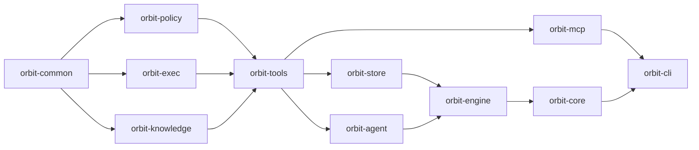

## Crate Graph

Orbit is a layered Rust workspace. Lower layers do not depend on higher layers.

## Boundaries

| Crate | Role |
|-------|------|
| `orbit-common` | Shared domain types, errors, IDs, utility helpers. |
| `orbit-knowledge` | Graph parsing, storage helpers, selectors, graph services. |
| `orbit-store` | YAML and SQLite stores. |
| `orbit-agent` | HTTP loop transport and retained CLI runtimes. |
| `orbit-engine` | Activity/job execution, template rendering, retries, CLI subprocess runner. |
| `orbit-tools` | Built-in tool registry and external tool integration. |
| `orbit-mcp` | MCP adapter over the tool registry. |
| `orbit-core` | Runtime bootstrap, config, command dispatch, default asset seeding. |
| `orbit-cli` | Clap-based CLI entrypoint. |

## Design Mirror

The architecture design docs under `architecture/design/` are generated from the repository's `docs/design/` tree before `dev`, `check`, and `build`.

Do not edit generated mirror pages directly. Edit the source documents in `docs/design/`.
